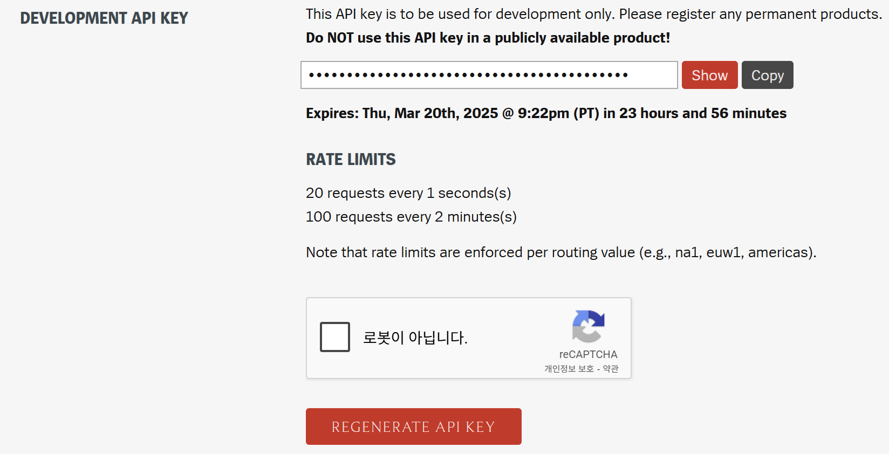
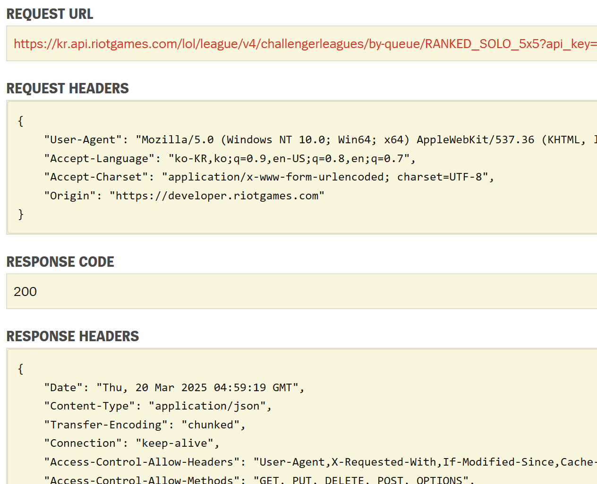

# Riot API Usage

[Riot API](https://developer.riotgames.com/apis)의 간단한 사용 방법입니다.

### Usage

#### 1. Get API key

먼저 개인 API key가 필요합니다.

라이엇 계정 홈페이지 로그인하여 Dashboard에서 API key를 발급 받을 수 있습니다.


#### 2. Request

원하는 항목 별로, request를 보낼 수 있습니다.



그림에 있는 `REQUEST URL`을, `python`의 `requests` 라이브러리를 이용하여 요청할 수 있습니다.

그림처럼 `RESPONSE CODE`(혹은 `STATUS CODE`)가 `200`이면, 요청이 잘 불러와 진 것입니다.

``` python
def _make_response(url):
    response = requests.get(url) # URL 요청

    # 잘 불러와졌는지 확인
    if response.status_code == 200:
        return response.json() # 잘 불러와졌으면 return
    else:
        raise Exception(f"API request failed with status {response.status_code}")
```
API 받아오는 더 많은 코드는, [LOL_data_pipeline.py](../modules/LOL_data_pipeline.py) 참고.